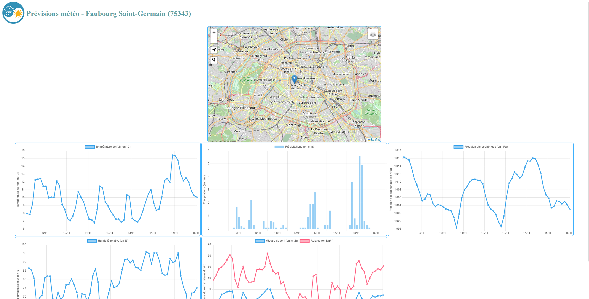

Web interface fetching weather forecast data from Infoclimat.fr.

A Leaflet minimap allow the user to choose a location, including geolocation, geocoding (search bar) and on click location.

Requirements:

1. Node.js installed. 
2. Express (command _npm install express_ in bash)
3. Launch the command "node index.js" directly from its folder to be able to access it under localhost:5500.

Hosting has to be defined to use it from multiple machines.

To use the application:
[click here]([https://bloom-shy-tub.glitch.me/](https://bloom-shy-tub.glitch.me/)https://bloom-shy-tub.glitch.me/)
